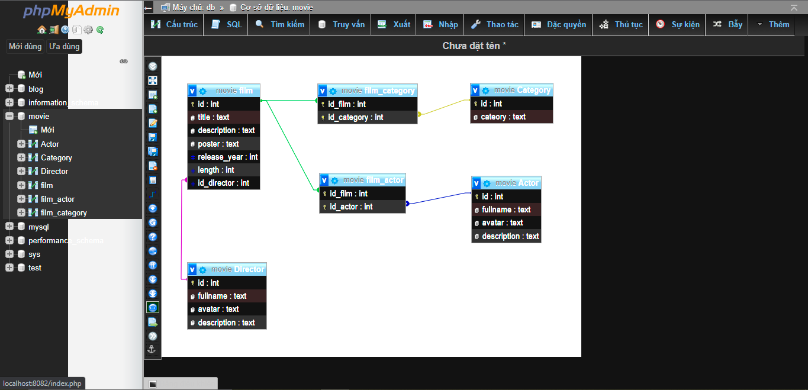

# MOVIE
### Create **database**

```roomsql
   CREATE DATABASE Movie;
```

### Create table `description`
```roomsql
    CREATE TABLE director(
       id int PRIMARY KEY AUTO_INCREMENT,
       fullname text not null,
       avatar text not null,
       description text not null
    )
```
### Create table `film`
```roomsql
    CREATE TABLE film(
        id int PRIMARY KEY AUTO_INCREMENT,
        title text not null,
        description text not null,
        poster text not null,
        release_year int not null,
        length int not null,
        id_description int,
        FOREIGN KEY (id_description) REFERENCES description(id)
    )
```
### Create table `actor`
```roomsql
    CREATE TABLE actor(
        id int PRIMARY KEY AUTO_INCREMENT,
        fullname text not null,
        avatar text not null,
        description text not null
    )
```
### Create table `category`
```roomsql
    CREATE TABLE category(
        id int PRIMARY KEY AUTO_INCREMENT,
        category text not null
    )

```
### Create table `actor_film`
```roomsql
    CREATE TABLE actor_film(
        id_actor int,
        id_film int,
        PRIMARY KEY (id_actor, id_film),
        FOREIGN KEY (id_actor) REFERENCES actor(id),
        FOREIGN KEY (id_film) REFERENCES film(id)
    )
```
### Create table `category_film`
```roomsql
    CREATE TABLE category_film(
        id_category int,
        id_film int,
        PRIMARY KEY (id_category, id_film),
        FOREIGN KEY (id_category) REFERENCES category(id),
        FOREIGN KEY (id_film) REFERENCES film(id)
    )
```
### Image design set
